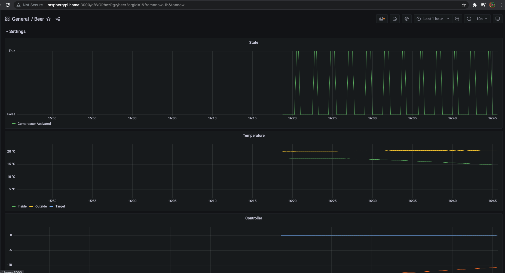

# frust

Fridge controller written in Rust.



**alarm.sh** Bash script to monitor fridge temperature.

# Services

Overview of the different services running on the Raspberry Pi.

```
sudo systemctl start frust          # Start the controller
sudo systemctl start alarm          # Start the monitor
```
