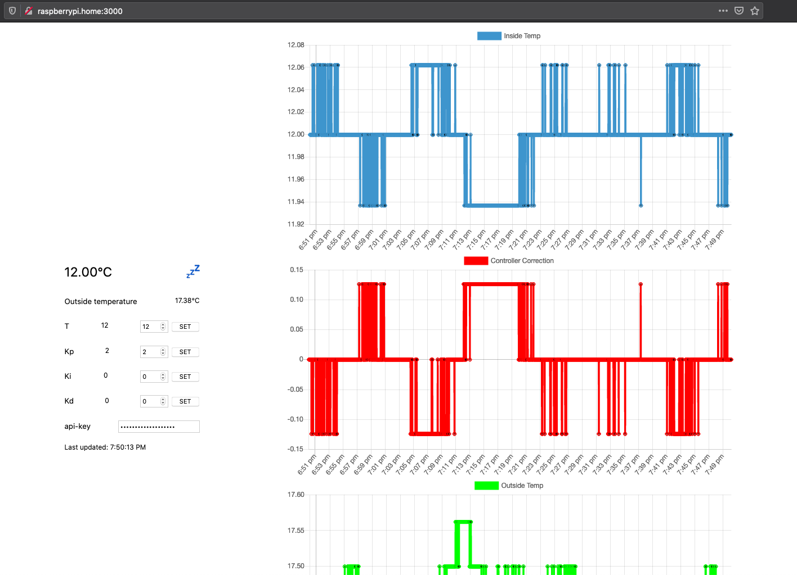

# frust

Fridge controller written in Rust.



**controller/** the Rust controller to maintain fridge temperature.

**server/** the Typescript/NodeJS server to plot graphs and record settings and change over time.

**alarm** Bash script to monitor fridge temperature.

# Services

Overview of the different services running on the Raspberry Pi.

```
sudo systemctl start frust          # Start the controller
sudo systemctl start frust-server   # Start the server
sudo systemctl start alarm          # Start the monitor
```

## TODO
- [ ] Disable heater with environment variable
- [ ] 